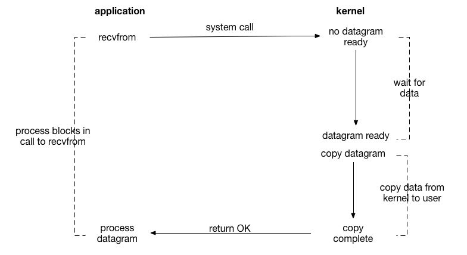
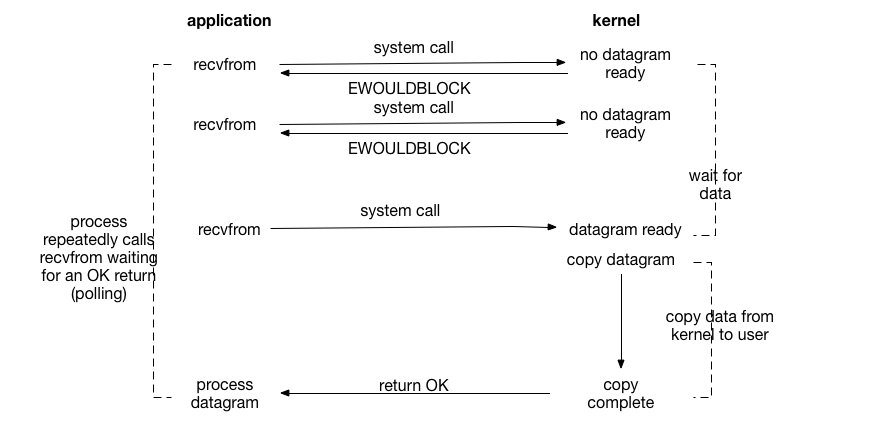

# Linux 中的五种IO模型

IO模型的选择在Linux网络编程中十分重要，在Unix/Linux环境中主要提供了五种不同的IO模型，分别是阻塞式IO、非阻塞式IO、IO多路复用、信号驱动式IO和异步IO。

通常一个输入操作包含两个不同阶段：

1. 等待数据准备好
2. 从内核向进程复制数据

例如，对于一个网络套接字上的输入操作，第一步通常涉及到发生系统调用，用户态切换到内核态并等待数据从网络中到达，当所有等待分组到达时，数据被复制到内核中的某个缓冲区。第二步则是将数据从内核缓冲区复制到应用进程缓冲区。

>磁盘文件的IO比较特殊，内核采用缓冲区cache加速磁盘IO请求。因而一旦请求的数据到达内核缓冲区cache，对磁盘的write()操作立即返回，而不用等待将数据写入磁盘后再返回（除非在打开文件时指定了O_SYNC标志）。与之相对应的read()操作将数据从内核缓冲区cache移动到用户的缓冲区中，如果请求的数据不在内核缓冲区cache中，内核会让进程休眠，同时执行对磁盘的读操作。所以实际上在磁盘IO中，等待阶段是不存在的，因为磁盘文件并不像网络IO那样，需要等待远程传输数据。

## 阻塞式I/O模型

Linux中，默认情况下所有的socket都是阻塞的。这里有必要辨析以下阻塞和非阻塞这两个概念，这两个概念描述的是用户线程调用内核I/O操作的方式，其中阻塞是指I/O操作需要彻底完成后才返回到用户空间；而非阻塞则是指I/O操作被调用后立即返回给用户一个状态值，不需要等到I/O操作彻底完成。

除非特别指定，几乎所有的I/O接口都是阻塞型的，即系统调用时不返回调用结果，只有当该系统调用获得结果或者超时出错才返回。这样的机制给网络编程带来了较大的影响，当线程因处理数据而处于阻塞状态时，线程将无法执行任何运算或者相应任何网络请求。

- 改进方案

在服务器端使用阻塞I/O模型时结合多进程/多线程技术。让每一个连接都拥有独立的进程/线程，任何一个连接的阻塞都不会影响到其他连接。（选择多进程还是多线程并无统一标准，因为进程的开销远大于线程，所以在连接数较大的情况下推荐使用多线程。而进程相较于线程具有更高的安全性，所以如果单个服务执行体需要消耗较多的CPU资源，如需要进行大规模或长时间的数据运算或文件访问推荐使用多进程）。

当连接数规模继续增大，无论使用多线程还是多进程都会严重占据系统资源，降低系统对外界的响应效率，线程或者进程本身也更容易陷入假死。此时可以采用“线程池”或“连接池”来降低创建和销毁进程/线程的频率，减少系统开销。

## 非阻塞式I/O模型

当一个套接字被设置为非阻塞时，我们告诉内核：“当我请求的I/O操作无法完成且会使进程进入休眠时，不要让进程休眠，而是返回一个错误。” 图示如下：

- 对于前三次调用 `recvfrom`，由于没有数据可返回，内核立即返回一个 `EWOULDBLOCK` 错误。
- 第四次调用 recvfrom 时，数据报已准备好，它被复制到我们的应用程序缓冲区中，并`recvfrom`成功返回。然后我们处理数据。

当应用程序处于循环中调用`recvfrom`非阻塞描述符时，这称为**轮询**。应用程序不断轮询内核以查看某个操作是否已准备就绪。这通常会浪费 CPU 时间，但这种模型偶尔会遇到，通常在专用于一项功能的系统中。

## I/O 多路复用模型

使用 I/O 多路复用时，我们调用 `select` 或 `poll`，并阻塞在这两个系统调用之一，而不是阻塞在实际的 I/O 系统调用中。下图总结了 I/O 多路复用模型：

我们在调用 `select` 时阻塞，等待数据报套接字变为可读。当 `select` 返回套接字可读时，我们再调用 `recvfrom` 将数据报复制到应用程序的缓冲区中。

### 与阻塞 I/O 模型相比

比较图 6.3 和图 6.1：

**缺点**：使用 `select` 需要进行两次系统调用（`select` 和 `recvfrom`），而不是一次。
**优点**：我们可以等待多个描述符准备就绪（详见本章后面的 `select` 函数）。

### **阻塞 I/O 的多线程**

另一个与此密切相关的 I/O 模型是使用多线程和阻塞 I/O。该模型与上面描述的模型非常相似，不同之处在于，程序不是使用 `select` 来阻塞多个文件描述符，而是使用多个线程（每个线程对应一个文件描述符），然后每个线程可以自由调用像 `recvfrom` 这样的阻塞系统调用。

## 信号驱动 I/O 模型

信号驱动 I/O 模型使用信号，通知内核在描述符就绪时通过 `SIGIO` 信号通知我们。图示如下：

我们首先启用套接字的信号驱动 I/O（第 25.2 节），并使用 `sigaction` 系统调用安装一个信号处理器。该系统调用会立即返回，且我们的进程会继续执行，不会被阻塞。
当数据报准备好读取时，会为我们的进程生成 `SIGIO` 信号。我们可以选择以下两种处理方式：

- 通过调用 `recvfrom` 从信号处理器中读取数据报，然后通知主循环数据已准备好处理（第 25.3 节）。
- 通知主循环，由主循环来读取数据报。

该模型的优点在于，我们在等待数据报到达时不会被阻塞。主循环可以继续执行，只需等待信号处理器通知数据已准备好处理或数据报已准备好读取。

## 异步 I/O 模型

异步 I/O 是由 POSIX 规范定义的，各种在形成当前 POSIX 规范的不同标准中出现的实时函数差异已被协调一致。

这些函数的工作方式是告诉内核启动操作，并在整个操作（包括将数据从内核复制到我们的缓冲区）完成时通知我们。这种模型与信号驱动 I/O 模型的主要区别在于，信号驱动 I/O 是内核在 I/O 操作可以开始时通知我们，而异步 I/O 是内核在 I/O 操作完成时通知我们。下图是一个示例：

- 我们调用`aio_read`（POSIX 异步 I/O 函数以`aio_`或开头`lio_`）并向内核传递以下内容：

  - 描述符、缓冲区指针、缓冲区大小（与 相同的三个参数`read`），
  - 文件偏移量（类似于`lseek`），
  - 以及如何在整个操作完成时通知我们。

  该系统调用立即返回，并且我们的进程在等待 I/O 完成时不会被阻塞。

- 在这个例子中，我们假设要求内核在操作完成时生成某个信号。这个信号直到数据被复制到我们的应用程序缓冲区中才会生成，这与信号驱动的 I/O 模型不同。

## 同步 I/O 与异步 I/O 

POSIX 对这两个术语的定义如下：

- 同步 I/O 操作会导致请求进程被阻塞，直到该 I/O 操作完成。
- 异步 I/O 操作不会导致请求进程被阻塞。

使用这些定义，前四种 I/O 模型（阻塞、非阻塞、I/O 多路复用和信号驱动 I/O）都是同步的，因为实际的 I/O 操作（`recvfrom`）会阻塞进程。只有异步 I/O 模型符合异步 I/O 定义。