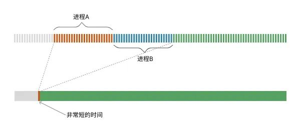
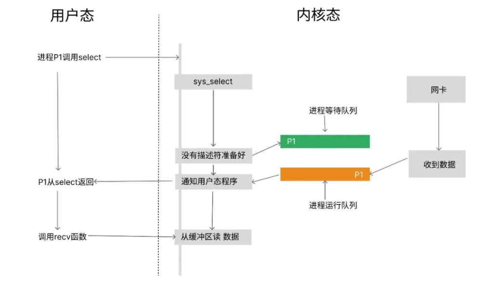
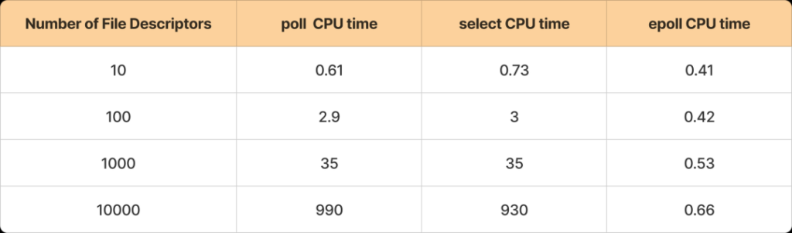
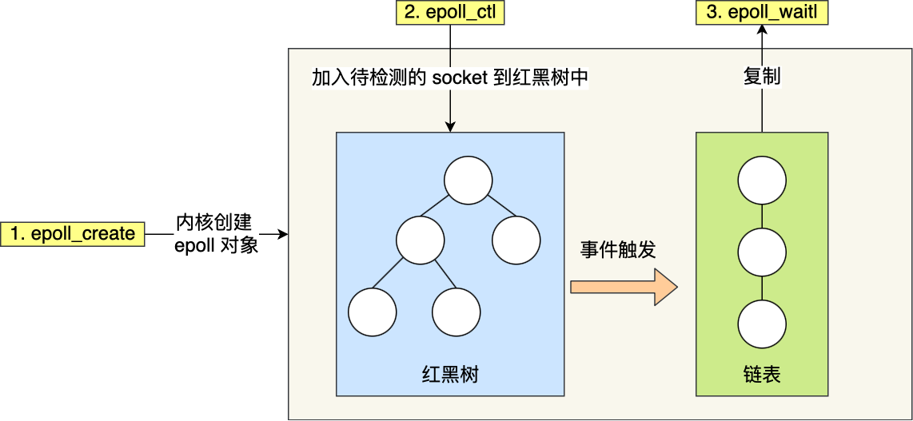
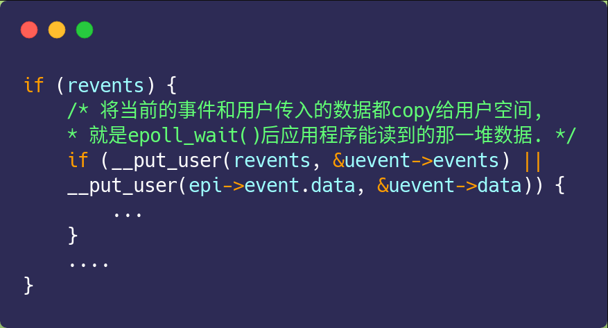

# select、poll、epoll

## select

select核心就是一个方法，签名如下：

```c
int select(int maxfdp1, 
            fd_set *readset, 
            fd_set *writeset, 
            fd_set *exceptset, 
            const struct timeval *timeout);
```

这个方法看起来有点吓人，这么多参数，又是结构体，又是const，搞不明白呀！

对于一个I/O描述符，通常有读、写、异常三种情况，select函数的readset、writeset、exceptset分别就对应了I/O的读、写和异常。表示，当前程序关心readset里描述符是否可读，writeset里的描述符是否可写，exceptset中的描述符是否出现了异常。

只要readset、writeset、exceptset中有一个满足条件，select函数立即返回，返回值是可处理的I/O数量。

那第一个参数是干嘛的呢？

select的第一个参数表示的是当前待监听的描述符基数。比如，当前监听的最大描述符是3，那么参数maxfdp1就应该是4（这是因为描述符是从0开始的）。

你可以思考一下为什么需要这个参数呢？

select的第一个参数表示的是当前待监听的描述符基数。比如，当前监听的最大描述符是3，那么参数maxfdp1就应该是4（这是因为描述符是从0开始的）。

你可以思考一下为什么需要这个参数呢？

在select中，用来保存监听集合的数据结构，是一个长度为32的整型数组，这个数组每个元素也是32位的（这大概是因为当时还没64位机器吧）这个数组大概像下面这样：

```c
int32_t fds[32];
```

这个数组每个元素占32bit，总共就占32*32bit=1024bit。假设每一位代表一个套接字，这个bit如果是0代表不可用。如果是1代表可用。如下：

| 1023 | 1022 | …    | 1    | 0    |
| ---- | ---- | ---- | ---- | ---- |
| 0    | 1    | …    | 1    | 0    |

发现没有，这个数据结构就是一个位图的经典实现。

上面的例子中，在一轮select的调用中，描述符1023不需要处理，1022需要处理，1需要处理，0不需要处理。

我们再回到maxfdp1参数就比较好理解了，当描述符为1023时，maxfdp1就应该是1024。而我们说，select中使用一个长度为32的32位整型数组保存监听套接字集合。所以，select最大可以处理32*32=1024个描述符。

你可能会问，当前描述符大于1023会发生什么呢？答案是，会报错。甚至可能会出现内存溢出的问题。所以，我们在使用select的时候要注意！

最后我们看timeout参数，这个参数是一个结构体，如下：

```c
struct timeval {
  long tv_sec;  // 秒
  long tv_usec; // 微秒
}
```

这个参数表示，超过一定时间如果还没有可以处理的描述符，直接从select函数返回，返回值为0。

这个参数可能传值有以下几种情况：

- 传NULL，如果没有I/O可以处理，一直等待
- 设置成对应的秒或者微秒，表示select等待相应的时间之后如果没有I/O可以处理就返回
- 将tv_sec和tv_usec都设置成0，表示不用等待立即返回

最后，select函数如果返回-1表示出错，返回0表示超时，返回大于0表示可操作的I/O数量。


### **select的实现原理** 

当我们的程序编写好之后，会通过编译器将程序翻译成一条条的机器指令，这些指令通常会保存在一个文件当中。当我们将程序运行起来之后，这个程序文件中的指令会被加载到内存当中，通过控制总线和数据总线发送到CPU去执行。下面我们就来简单回顾一下CPU运行的原理。

CPU通过时钟信号来同步其内部的操作，每个时钟周期都会执行相应的机器指令。我们可以将CPU的时钟信号想象成钟摆，钟摆滴答一次就可以认为是一个时钟周期。

当我们将程序在操作系统中运行起来之后，操作系统会为这个程序分配对应的进程ID，内存空间等信息。然后将进程信息放到一个运行中的队列。操作系统内核的调度程序会不断的从这个队列取出对应程序的机器指令放到CPU去执行。

当然，我们平时在使用计算机的时候，经常同时打开多个应用。看起来它们像是同时在运行。实际上不是的，这只是操作系统的障眼法，内核任务调度器会尽量公平的将CPU的时间分摊到各个应用程序，执行完一定的时钟周期就停下来让其它的程序执行一会儿，就这样一直交替运行，由于CPU执行的很快，我们人类察觉不出来，所以看起来就像是在同时运行。

一颗主频2GHz的CPU，一个时钟周期是0.5纳秒，这是什么概念呢？相当于1秒钟内可以摆动20亿次，假如最理想情况1个时间周期执行1条指令，那么1秒钟可以执行20亿次指令。

下面这张图是多个进程运行的示例



图中，上面部分是整个CPU执行时间线中的一个小片段被放大的样子，时间被切成了非常多的小片段，每一个小片就是一个时钟周期，进程A和进程B在内核调度程序的控制下，分配了时间片，进程A执行一会儿然后进程B再执行一会儿。而在现实中这个时间是非常短的，短到人类察觉不到。

好了，我们上面花了些时间来介绍了CPU执行程序的大致原理。我们思考一个问题，上面我们说基于select的I/O复用模型在调用select的时候会阻塞在select函数上。我们很自然的会想到，这里的阻塞会不会占用CPU呢？

答案是不会的，我们前面讲程序在运行起来之后，首先会将程序的进程信息放到运行队列待内核调度。

select的实现逻辑是，如果当前没有准备好的可操作描述符，会将当前调用select的进程从运行队列中摘掉，然后放到一个等待运行的队列中。此时，调用select的进程就没有运行的机会了，看起来的效果就是被阻塞在了select函数调用上。其流程大致如下：



首先，进程P1调用select函数，这个select函数最终会调用操作系统内核的sys_select函数。发现没有准备好的描述符。就将进程P1放到等待运行队列里了。此时，进程P1的现象就像是被挂起了。

接着，过了一会儿网卡收到数据，发现进程P1正在监听当前套接字，内核程序就把进程P1从等待队列里移动到运行队列，让P1有运行的机会。此时，select函数的返回值以及readset都已经被赋值过了，进程P1继续运行，从select函数返回，并且能拿到select返回的数据了。

最后，进程P1再调用recv函数从读缓冲区读取数据。

你可能会有疑问，网卡收到数据之后，怎么知道select在等待的描述符是哪个呢？这是由于select针对每个描述符都注册了回调函数，当网卡收到数据的时候，首先通过对应的描述符找到回调函数，这个回调函数执行之后，select的返回值和readset的值就被设置好了。

下面，我们通过select的源码来分析一下这个过程，我这里使用的是linux2.6版本的内核代码。
select相关的代码在fs/select.c下面，我们调用select函数最终实际调用的是一个叫sys_select的函数，如下：

```c
asmlinkage long
sys_select(int n, fd_set __user *inp, fd_set __user *outp, fd_set __user *exp, struct timeval __user *tvp)
{
  ... 
  // 超时时间默认是一个很在的值，可以认为永远等下去
  // 对应的就是参数NULL
  timeout = MAX_SCHEDULE_TIMEOUT;
  // 如果设置了超时时间，会设置对应的超时
  if (tvp) {
     ...
  }

  ...
  
  // 调用do_select函数查找可用描述符
  ret = do_select(n, &fds, &timeout);
  ...

  // 如果结果小于0，跳转到out
  if (ret < 0)
    goto out;
  // 如果结果为0，等待信号
  // 其中current是当前进程，也就是我们
  // 调用select的那个进程的指针
  if (!ret) {
    ret = -ERESTARTNOHAND;
    if (signal_pending(current))
      goto out;
    ret = 0;
  }

  // 这里重写了in/out/ex描述符集合
  // 所以为什么我们在检查之后要重置
  set_fd_set(n, inp, fds.res_in);
  set_fd_set(n, outp, fds.res_out);
  set_fd_set(n, exp, fds.res_ex);

out:
  select_bits_free(bits, size);
out_nofds:
  return ret;
}
```

然后我们接着看最核心的do_select函数，如下：

```c
int do_select(int n, fd_set_bits *fds, long *timeout)
{
  struct poll_wqueues table;
  poll_table *wait;
  int retval, i;
  long __timeout = *timeout;

  spin_lock(¤t->files->file_lock);
  retval = max_select_fd(n, fds);
  spin_unlock(¤t->files->file_lock);

  if (retval < 0)
    return retval;
  n = retval;  // 这里的n就是前面我们说的最大描述符+1

  poll_initwait(&table);
  wait = &table.pt;
  if (!__timeout)
    wait = NULL;
  retval = 0;
  for (;;) {
    unsigned long *rinp, *routp, *rexp, *inp, *outp, *exp;

    set_current_state(TASK_INTERRUPTIBLE);

    inp = fds->in; outp = fds->out; exp = fds->ex;
    rinp = fds->res_in; routp = fds->res_out; rexp = fds->res_ex;
    // 可以看到，这里是i < n，所以为什么maxfdp1
    // 必需是最大描述符+1
    for (i = 0; i < n; ++rinp, ++routp, ++rexp) {
      // 这个循环里其实就是从in/out/ex中寻找
      // 当前数组下标是否有=1的
      // 找到之后分别放在res_in、res_out、res_ex中
      ...
      
      if (res_in)
        *rinp = res_in;
      if (res_out)
        *routp = res_out;
      if (res_ex)
        *rexp = res_ex;
    }
    wait = NULL;
    if (retval || !__timeout || signal_pending(current))
      break;
    if(table.error) {
      retval = table.error;
      break;
    }
    // 这里很重要，当一轮找下来没找到可用的描述符
    // 当前进程就会进入睡眠状态
    // 直到有可用的描述符，或者超时
    __timeout = schedule_timeout(__timeout);
  }
  // 返回用户态
  __set_current_state(TASK_RUNNING);

  poll_freewait(&table);

  /*
   * Up-to-date the caller timeout.
   */
  *timeout = __timeout;
  return retval;
}
```

我们再梳理一下整个流程

- 我们调用select函数实际是调用的是内核中的sys_select函数
- sys_select函数会调用do_select函数，查找是否有可用的描述符
- 在do_select中，有一个无限循环，每一轮都会从0遍历到maxfdp1+1，查找对应的描述字是否可用。
- 如果在一轮寻找中，没有查找到任何可用的描述符，调用schedule_timeout(__timeout)将当前进程放到待运行队列中。
- 当有可用描述符或者超时，当前进程会从睡眠中醒来，调用__set_current_state(TASK_RUNNING)将当前进程放到运行队列中，这样，select函数就返回了。

通过上面的分析，我们发现，select每一轮查找不管有没有可用描述符都会遍历maxfdp1这么多次，直觉上效率并不是很高，页实际情况也是这样的，这个在后面讲poll、epoll的时候你就能有感觉了。


**如果你想了解select更详细的实现细节，可以去读一读select的源码。比如，in、out、ex的数据结构到底是怎么设计的，数据是怎么遍历的，entry的回调函数又是怎么被运行的都可以在源码中找到答案。**

## poll

select 使用固定长度的 BitsMap，表示文件描述符集合，而且所支持的文件描述符的个数是有限制的，在 Linux 系统中，由内核中的 FD_SETSIZE 限制，默认最大值为 `1024`，只能监听 0~1023 的文件描述符。

poll 不再用 BitsMap 来存储所关注的文件描述符，取而代之用动态数组，以链表形式来组织，突破了 select 的文件描述符个数限制，当然还会受到系统文件描述符限制。

但是 poll 和 select 并没有太大的本质区别，**都是使用「线性结构」存储进程关注的 Socket 集合，因此都需要遍历文件描述符集合来找到可读或可写的 Socket，时间复杂度为 O(n)，而且也需要在用户态与内核态之间拷贝文件描述符集合**，这种方式随着并发数上来，性能的损耗会呈指数级增长。


## epoll

前面我们在介绍select和poll的时候发现，它们总是有这样或者那样的缺点。比如，select有最大描述符限制。poll虽然突破了最大描述符限制，但它本质上还是通过遍历最大描述符个数的方式去监听描述符。

下面这张图展示了select、poll、epoll在不同数量描述符的情况下的耗时



可以看到，select和poll在相同描述符数量时表现几乎一致，这是由于它们要找到可用描述符都要去遍历一遍集合中所有的元素。而epoll在10和10000的描述符的对比下，变化微乎其微，这足以看出epoll的强大。


### epoll原理

epoll 通过两个方面，很好解决了 select/poll 的问题。

*第一点*，epoll 在内核里使用**红黑树来跟踪进程所有待检测的文件描述符**，把需要监控的 socket 通过 `epoll_ctl()` 函数加入内核中的红黑树里，红黑树是个高效的数据结构，增删查一般时间复杂度是 `O(logn)`，通过对这棵红黑树进行操作，这样就不需要像 select/poll 每次操作时都传入整个 socket 集合，只需要传入一个待检测的 socket，减少了内核和用户空间大量的数据拷贝和内存分配。

*第二点*，epoll 使用事件驱动的机制，内核里**维护了一个链表来记录就绪事件**，当某个 socket 有事件发生时，通过回调函数内核会将其加入到这个就绪事件列表中，当用户调用 `epoll_wait()` 函数时，只会返回有事件发生的文件描述符的个数，不需要像 select/poll 那样轮询扫描整个 socket 集合，大大提高了检测的效率。

从下图你可以看到 epoll 相关的接口作用：



epoll 的方式即使监听的 Socket 数量越多的时候，效率不会大幅度降低，能够同时监听的 Socket 的数目也非常的多了，上限就为系统定义的进程打开的最大文件描述符个数。因而，**epoll 被称为解决 C10K 问题的利器**。

插个题外话，网上文章不少说，`epoll_wait` 返回时，对于就绪的事件，epoll 使用的是共享内存的方式，即用户态和内核态都指向了就绪链表，所以就避免了内存拷贝消耗。

这是错的！看过 epoll 内核源码的都知道，**压根就没有使用共享内存这个玩意**。你可以从下面这份代码看到， `epoll_wait` 实现的内核代码中调用了 `__put_user` 函数，这个函数就是将数据从内核拷贝到用户空间。



### 触发模式

epoll 支持两种事件触发模式，分别是**边缘触发（\*edge-triggered，ET\*）和水平触发（\*level-triggered，LT\*）**。

这两个术语还挺抽象的，其实它们的区别还是很好理解的。

- 使用边缘触发模式时，当被监控的 Socket 描述符上有可读事件发生时，**服务器端只会从 epoll_wait 中苏醒一次**，即使进程没有调用 read 函数从内核读取数据，也依然只苏醒一次，因此我们程序要保证一次性将内核缓冲区的数据读取完；
- 使用水平触发模式时，当被监控的 Socket 上有可读事件发生时，**服务器端不断地从 epoll_wait 中苏醒，直到内核缓冲区数据被 read 函数读完才结束**，目的是告诉我们有数据需要读取；

举个例子，你的快递被放到了一个快递箱里，如果快递箱只会通过短信通知你一次，即使你一直没有去取，它也不会再发送第二条短信提醒你，这个方式就是边缘触发；如果快递箱发现你的快递没有被取出，它就会不停地发短信通知你，直到你取出了快递，它才消停，这个就是水平触发的方式。

这就是两者的区别，水平触发的意思是只要满足事件的条件，比如内核中有数据需要读，就一直不断地把这个事件传递给用户；而边缘触发的意思是只有第一次满足条件的时候才触发，之后就不会再传递同样的事件了。

如果使用水平触发模式，当内核通知文件描述符可读写时，接下来还可以继续去检测它的状态，看它是否依然可读或可写。所以在收到通知后，没必要一次执行尽可能多的读写操作。

如果使用边缘触发模式，I/O 事件发生时只会通知一次，而且我们不知道到底能读写多少数据，所以在收到通知后应尽可能地读写数据，以免错失读写的机会。因此，我们会**循环**从文件描述符读写数据，那么如果文件描述符是阻塞的，没有数据可读写时，进程会阻塞在读写函数那里，程序就没办法继续往下执行。所以，**边缘触发模式一般和非阻塞 I/O 搭配使用**，程序会一直执行 I/O 操作，直到系统调用（如 `read` 和 `write`）返回错误，错误类型为 `EAGAIN` 或 `EWOULDBLOCK`。

一般来说，边缘触发的效率比水平触发的效率要高，因为边缘触发可以减少 epoll_wait 的系统调用次数，系统调用也是有一定的开销的的，毕竟也存在上下文的切换。

select/poll 只有水平触发模式，epoll 默认的触发模式是水平触发，但是可以根据应用场景设置为边缘触发模式。


### epoll_create

我们先来看一下epoll的函数签名，首先是创建一个epoll实例：

```c
int epoll_create(int size);
int epoll_create1(int flags);
```

和select、poll不同，epoll首先需要先创建一个epoll实例。函数返回值大于0表示epoll实例，返回-1表示出错。

size参数在之前的版本中含义是期望监听的描述符大小，在Linux2.6.8之后这个参数会被忽略，内核会动态分配描述符的大小，但我们在传参的时候还是会传一个大于0的数。

epoll_create1的flags传0和epoll_create是一样的效果。当然如果传非0就可以进一步设置epoll的行为。我们使用man命令看一下epoll_create1的文档。如下：

```c
man epoll_create1
...
epoll_create1()
       If  flags  is  0, then, other than the fact that the obsolete size argument is dropped, epoll_create1() is the
       same as epoll_create().  The following value can be included in flags to obtain different behavior:

       EPOLL_CLOEXEC
              Set the close-on-exec (FD_CLOEXEC) flag on the  new  file  descriptor.   See  the  description  of  the
              O_CLOEXEC flag in open(2) for reasons why this may be useful.
...
```

其中EPOLL_CLOEXEC一般用在执行exec系列函数启动新进程的时候，自动关闭原描述符，防止新的进程访问到原来老的描述符。

简单来说，当你创建一个子进程，但又不希望子进程访问到父进程创建的描述符，就可以使用EPOLL_CLOECEC。


### epoll_ctl

创建完epoll实例之后，我们就可以对它进行各种控制了，控制epoll实例的函数是epoll_ctl，它的签名如下：

```c
int epoll_ctl(int epfd, int op, int fd, struct epoll_event *event);
```

函数返回0表示成功，返回-1表示出错。这个函数有4个参数：

**第一个**参数就是我们使用poll_create创建出来的epoll实例。

**第二个**参数表示增、删、改分别对应

- **EPOLL_CTL_ADD**: 向epoll实例注册文件描述符对应的事件
- **EPOLL_CTL_DEL**: 删除epoll实例中文件描述符对应的事件
- **EPOLL_CTL_MOD**: 修改epoll实例中文件描述符对应的事件

**第三个**参数是我们要注册事件的描述符，在这个系列文章中通常都是网络套接字

**第四个**参数是对事件的描述，是一个结构体，如下：

```c
typedef union epoll_data {
   void        *ptr;
   int          fd;
   uint32_t     u32;
   uint64_t     u64;
} epoll_data_t;

struct epoll_event {
   uint32_t     events;      /* Epoll 事件*/
   epoll_data_t data;       
};
```

这里的事件和前面讲poll的时候基本上是一样的，下面是在使用epoll的时候，我们常用的事件类型：

- EPOLLIN: 表示描述符可读
- EPOLLOUT: 表示描述符可写
- EPOLLRDHUP: 表示描述符一端已经关闭或者半关闭
- EPOLLHUP: 表示对应描述符被挂起
- EPOLLET:  边缘触发模式edge-triggered，不设置默认level-triggered


### epoll_wait

事件设置好了之后，我们就可以调用epoll_wait来等待可用的描述符了，它的原型如下：

```c
int epoll_wait(int epfd, struct epoll_event *events, int maxevents, int timeout);
```

函数返回大于0表示事件个数，返回0表示超时，出错返回-1

有4个参数：

- **第一个**参数是epoll实例
- **第二个**参数是返回的要处理的I/O事件，是一个数组，大小是epoll_wait返回值，每一个元素是一个待处理的I/O事件。
- **第三个**参数表示epoll_wait可以返回的最大事件数。
- **第四个**参数是超时时间，如果设置-1表示不超时，设置0表示立即返回，和select基本是一致的。


## 总结

最基础的 TCP 的 Socket 编程，它是阻塞 I/O 模型，基本上只能一对一通信，那为了服务更多的客户端，我们需要改进网络 I/O 模型。

比较传统的方式是使用多进程/线程模型，每来一个客户端连接，就分配一个进程/线程，然后后续的读写都在对应的进程/线程，这种方式处理 100 个客户端没问题，但是当客户端增大到 10000 个时，10000 个进程/线程的调度、上下文切换以及它们占用的内存，都会成为瓶颈。

为了解决上面这个问题，就出现了 I/O 的多路复用，可以只在一个进程里处理多个文件的 I/O，Linux 下有三种提供 I/O 多路复用的 API，分别是：select、poll、epoll。

select 和 poll 并没有本质区别，它们内部都是使用「线性结构」来存储进程关注的 Socket 集合。

在使用的时候，首先需要把关注的 Socket 集合通过 select/poll 系统调用从用户态拷贝到内核态，然后由内核检测事件，当有网络事件产生时，内核需要遍历进程关注 Socket 集合，找到对应的 Socket，并设置其状态为可读/可写，然后把整个 Socket 集合从内核态拷贝到用户态，用户态还要继续遍历整个 Socket 集合找到可读/可写的 Socket，然后对其处理。

很明显发现，select 和 poll 的缺陷在于，当客户端越多，也就是 Socket 集合越大，Socket 集合的遍历和拷贝会带来很大的开销，因此也很难应对 C10K。

epoll 是解决 C10K 问题的利器，通过两个方面解决了 select/poll 的问题。

- epoll 在内核里使用「红黑树」来关注进程所有待检测的 Socket，红黑树是个高效的数据结构，增删查一般时间复杂度是 O(logn)，通过对这棵黑红树的管理，不需要像 select/poll 在每次操作时都传入整个 Socket 集合，减少了内核和用户空间大量的数据拷贝和内存分配。
- epoll 使用事件驱动的机制，内核里维护了一个「链表」来记录就绪事件，只将有事件发生的 Socket 集合传递给应用程序，不需要像 select/poll 那样轮询扫描整个集合（包含有和无事件的 Socket），大大提高了检测的效率。

而且，epoll 支持边缘触发和水平触发的方式，而 select/poll 只支持水平触发，一般而言，边缘触发的方式会比水平触发的效率高。


参考：[select的使用及原理](https://www.pudn.club/programming/c-programming-socket-network-select/)

参考：[I/O 多路复用：select/poll/epoll](https://www.xiaolincoding.com/os/8_network_system/selete_poll_epoll.html)

